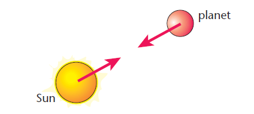

# Part 2. Celestial Mechanics simulation [[toc](../README.md#table-of-content)]

Reading data about celestial objects gathered by NASA is great, but what if we
were able to compute the trajectories of any celestial object ourselves and show
their movements in a little simulation?

This second part will be dedicated to this very question!

> :exclamation: **Important**
>
> your code for this part should go in a source file called `sim.py` and
> should run without issues when calling the following command in a terminal
> ```shell
> python sim.py
> ```
>
> so don't forget to create this new `sim.py` file :wink:

### Question 2.1 [[toc](../README.md#table-of-content)]
#### Defining celestial objects

The simplest and only object that needs to be manipulated in such a simulation
will be refered to as a _body_.

> :bulb: **Note**
>
> some of you might be familiar with the $3$-body problem, these are the bodies
> we talk about!

Here, a _body_ is anything that has a _position_ in 3D space, a _velocity_ in
3D space, a _mass_ and a _density_.
For the sake of rendering these bodies on screen, we will add a _color_ property
to them.

:file_folder: Create a file `sim.py`.

:pencil: Write a class called `Body` with the fields mentionned above:
- `pos` is a vector in 3D space
- `vel` is a vector in 3D space
- `mass` is a real number, the _mass_ expressed in $\text{kg}$
- `density` is a real number, the _density_ expressed in $\text{kg}.\text{m}^{-3}$
- `color` is a tuple of three integers between $0$ and $255$, e.g. _red_,
  _green_ and _blue_ would be `(255, 0, 0)`, `(0, 255, 0)` and `(0, 0, 255)`
  respectively

:pencil: Let's define a simple 2-body system with a planet and one moon:
- the planet will be a _blue_ body at the _center_ of the referential with
  _no speed_, a mass of $5.98 \times 10^{24}$ $\text{kg}$ and a density of
  $1.0$ $\text{kg}.\text{m}^{-3}$.
- the moon will be a _grey_ ($(200, 200, 200)$ should be ok) body with a
  mass of $1.23 \times 10^{21}$ $\text{kg}$ and a density of $1.0$
  $\text{kg}.\text{m}^{-3}$. It should be $3.5 \times 10^{8}$ $\text{m}$ away from
  the _planet_ and have an initial speed that puts it in a circular or
  elliptical orbit around the _planet_.

> :bulb: **Note**
>
> in order to put a body $A$ in a circular orbit around another body $B$ of
> mass $M$, respectively the satellite and the Earth in the image below, where
> the distance between $A$ and $B$ is $r$ and $B$ has no speed, then the initial
> velocity vector $v$ of $A$ should
> - be orthogonal to the vector between $A$ and $B$
> - have a magnitude of $\sqrt{\frac{GM}{r}}$
>
> 
>
> > image from [_Name Some of the Functions of Earth Orbiting Satellites_](https://terry-yersblogknapp.blogspot.com/2022/05/name-some-of-functions-of-earth.html)
>
> slightly changing this initial speed will cause $A$ to enter an elliptical
> orbit around $B$.

> :bulb: **Note**
>
> the value of the gravitational constant $G$ is
> $6.67 \times 10^{-11}$ $\text{N}.\text{m}^{2}.\text{kg}^{-2}$

> :bulb: **Note**
>
> to represent 3D vectors, you can use the `Vector3D` class from the `src.vec3`
> module provided with the class material.

### Question 2.2 [[toc](../README.md#table-of-content)]
#### May the force be with you

Now that we have a few bodies, we can compute the force applied to each pair of them.

The force applied by a body $A$ of mass $m_{A}$ at position $\vec{p_A}$ to a body $B$
of mass $m_{B}$ at position $\vec{p_B}$ is expressed as

$$\vec{F_{A \rightarrow B}} = - G \frac{m_{A}m_{B}}{||\vec{r}||^2}\frac{\vec{r}}{||\vec{r}||}$$
where $\vec{r}$ is the vector from $A$ to $B$



:pencil: Write a method `force` for the class `Body` that takes another `Body`
as parameter and returns the force between the two bodies as a 3D vector.

### Question 2.3 [[toc](../README.md#table-of-content)]
#### Your system is out of date

Now that we can compute the forces between all the bodies in our system, we can
update their velocities and positions using the second law of Newton which
states
$$\vec{F} = m\vec{a}$$
where $\vec{F}$ is the force applied to a body, $m$ is its mass and $\vec{a}$ its
acceleration.

As a starter, the simplest integration scheme will be used, i.e. the
_forward Euler method_.
$$\vec{v_{t+1}} = \vec{v_{t}} + \text{dt} \times \vec{a_{t}}$$
$$\vec{p_{t+1}} = \vec{p_{t}} + \text{dt} \times \vec{v_{t+1}}$$

:pencil: Write a method `update` for the class `Body` that takes a `force` as a
3D vector and time step `dt` and returns a new `Body` with it's velocity and
position updated.

### Question 2.4 [[toc](../README.md#table-of-content)]
#### Preparing the simulation

In order to simulation the system and see the bodies in action, we will be using
the `Simulation` class from the `src.ui` module.

> :bulb: **Note**
>
> see [this document](src/README.md) for more information about the `src.ui` module

:pencil: Define `bodies` as a list containing our two bodies from [_Question 2.1_](#question-21-toc).

:pencil: Define `update` as a function that takes a list of bodies and a time step `dt`
and returns a list with the same number of bodies, all of them with their
velocities and positions updated.

---
---
> [go to next questions](simulation_energy.md)
